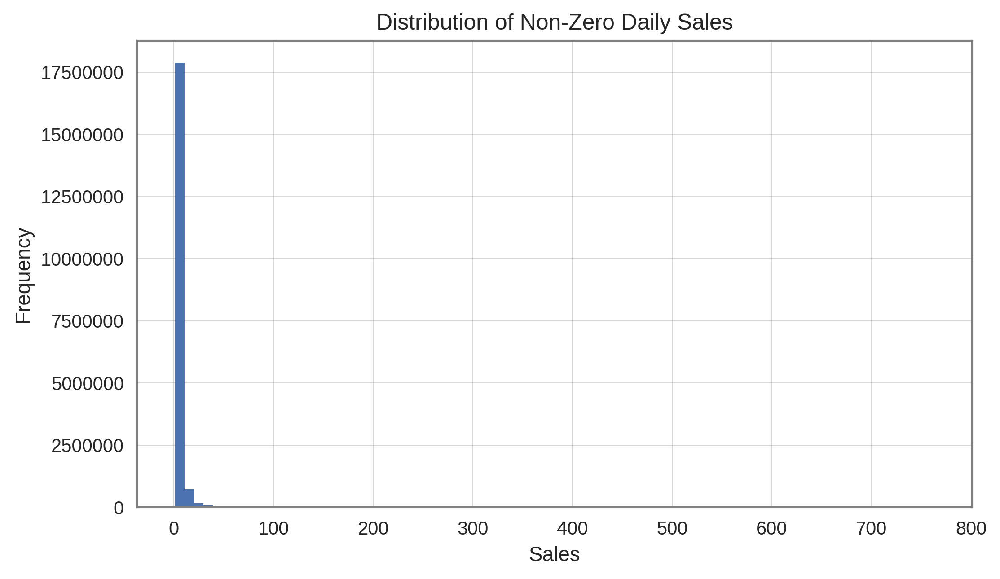
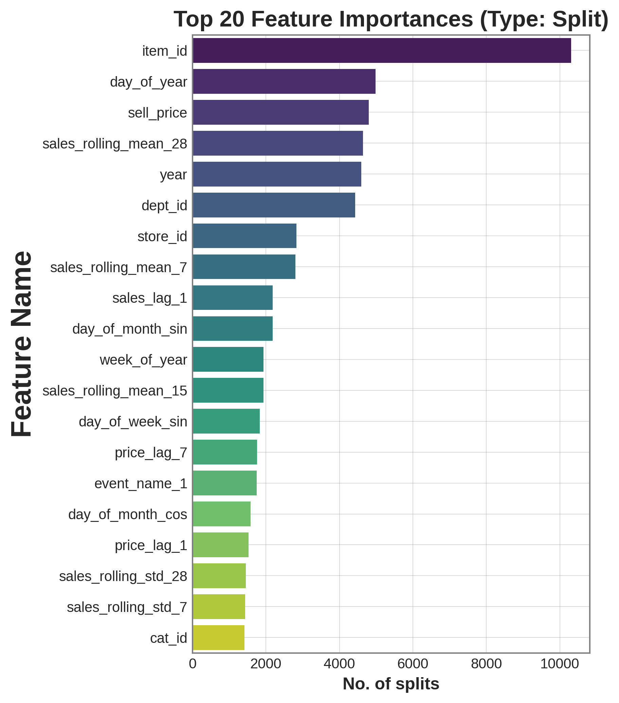

# RetailFlow: Scalable Demand Forecasting Pipeline

This project implements a high-performance predictive pipeline to forecast daily product demand for large-scale retail operations. Using the M5 Forecasting - Accuracy dataset, we developed a machine learning solution capable of processing approximately 60 million rows of data to optimize inventory placement and minimize operational waste.

## Team Members
* Phu Han
* Rizvan Ahmed Rafsan

## Project Overview
Inefficient inventory management in large-scale retail leads to significant revenue loss, primarily through stockouts and the high cost of emergency logistics to replenish missing items.

The goal of this project was to replace static decision-making processes with a predictive model of future product demand. By accurately forecasting unit sales, businesses can reduce "buffer" stock levels, lower storage costs, and ensure high-demand items are available when customers need them.

### Data Challenge: Sparsity
Approximately 68% of the data instances showed zero sales, creating a highly sparse pattern that required specialized handling via the Tweedie loss function.

## Data Sources
The project utilizes the M5 Forecasting - Accuracy dataset, consisting of:
* calendar.csv: Contains dates, weekdays, special events, and SNAP social assistance information.
* sales_train_validation.csv: Historical daily
* sell_prices.csv: Weekly price information for each product and store.

### Sales Trends
The dataset reveals significant variation across different store locations and categories, with the FOODS category and California (CA) stores showing the highest volumes.

## Technical Workflow

### 1. Data Processing and Memory Management
To handle the scale of nearly 60 million observations, we implemented:
* Custom Memory Optimization: Applied aggressive data type downcasting (e.g., converting float64 to float32 and int64 to int8/int16), reducing the memory footprint from 10.07 GB to 6.01 GB (a 40.3% reduction).
* Data Melting: Converted wide-format sales data into a long-format structure suitable for time-series modeling.
* Imputation: Handled missing unit prices using a combination of forward and backward filling to maintain historical pricing context.
### 2. Feature Engineering
We systematically augmented the dataset with features capturing temporal patterns and historical trends:
* Temporal Identifiers: Quarter, week of year, and binary indicators for weekends, paydays, and seasonal periods.
* Cyclic Encodings: Sine and Cosine transformations for months and days of the week to ensure the model recognizes the proximity of adjacent periods (e.g., December and January).
* Price Dynamics: Multi-horizon price lags and differentials (1, 7, 15, and 28 days) to detect promotional effects.
* Sales History: Multi-window rolling means and standard deviations to capture momentum and demand volatility.

### 3. Modeling Strategy
We compared three ensemble algorithms to establish a progression from a baseline to advanced boosting methods:
* Random Forest: Served as a robust baseline for evaluating non-linear interactions.
* XGBoost: Utilized for its strong regularization capabilities to prevent overfitting on sparse data.
* LightGBM: Selected for its computational efficiency on massive datasets through gradient-based one-side sampling (GOSS).

All models were configured with a Tweedie loss function to specifically address the 68% zero-sales sparsity found in the dataset.

## Results and Performance Comparison

| Model | Tuning Time | Training Time | Peak RAM | Final RMSE |
| :--- | :--- | :--- | :--- | :--- |
| LightGBM | 51 minutes | 5 minutes | 47.5 GB | 1.9213 |
| XGBoost | 1 hr 25 mins | 10 minutes | 45.2 GB | 1.9340 |
| Random Forest | 1 hr 39 mins | 27 minutes | 128.0 GB | 1.9392 |

### Key Conclusions:
* LightGBM was selected as the final model due to its superior speed and accuracy.
* It achieved the lowest RMSE (1.9213) while being 41% faster than XGBoost and 55% faster than the Random Forest baseline.
* Feature importance analysis revealed that product identifier (item_id), day of year, and sell price were the primary drivers of demand.

### Model Insights: Feature Importance
The LightGBM model prioritized item characteristics and temporal indicators (day of year) over raw price, suggesting that timing and product type are the primary drivers of retail demand.

## Future Work
* Hierarchical Forecasting: Reconciling individual item forecasts with store and category-level constraints using MinT or ERM approaches.
* Deep Learning: Exploring Temporal Fusion Transformers (TFT) or N-BEATS for capturing longer-range dependencies.
* Causal Inference: Isolating the specific impact of promotional events using synthetic control methods.

## Dependencies
* Python 3.x
* Pandas / NumPy
* Matplotlib / Seaborn
* Scikit-learn
* LightGBM
* XGBoost
* Optuna (for Hyperparameter Optimization)

## Citations
1. Fildes, R., Ma, S., & Kolassa, S. (2022). Retail forecasting: Research and practice. International Journal of Forecasting.
2. M5 Forecast Accuracy dataset. University of Nicosia. Available on Kaggle.